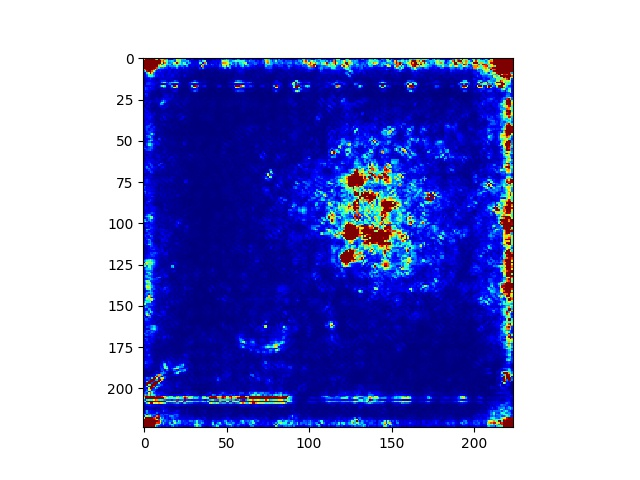

# I3D Feature Visualization
Feature visualization for I3D Network  

This code demonstrates how to visualize the features from 3D Convolutional network. We use vanilla gradients and guided back propagation to compute these saliency representation. Note, since the I3D is 3D convolution, hence, the input is a set of frames. To visualize the features, we need to modify the axis of <code>visualization.py </code> in the folder <code>/usr/local/lib/python2.7/dist-packages/saliency.</code>   

<h2>Running the code</h2> 
<h3>Setup </h3> 

1. Clone the project  
<code> $ git clone https://github.com/didpurwanto/feat_visualization</code> 

2. install saliency by  
<code >$ pip install saliency </code> 

3. edit the axis of visualization into 3, which originally set as 2.  
Go to folder <code >/usr/local/lib/python2.7/dist-packages/saliency </code> 
<code >line 23: axis = 3, instead of axis = 2. </code> 

4. put this folder project inside the I3D/experiments/dataset/ along with the train.py and test.py.  

<h3>Run the code</h3> 
<code >$ python feat_visualization.py</code>  
The results are stored in <code >.visualization/results/. </code>  

Input image:  
 
 
 
 

Output image: 
 
 
 
 

This code is inspired by PAIRML Saliency library <a href="https://github.com/PAIR-code/saliency/blob/master/Examples.ipynb">link</a>  

Thanks to 吳侒融.